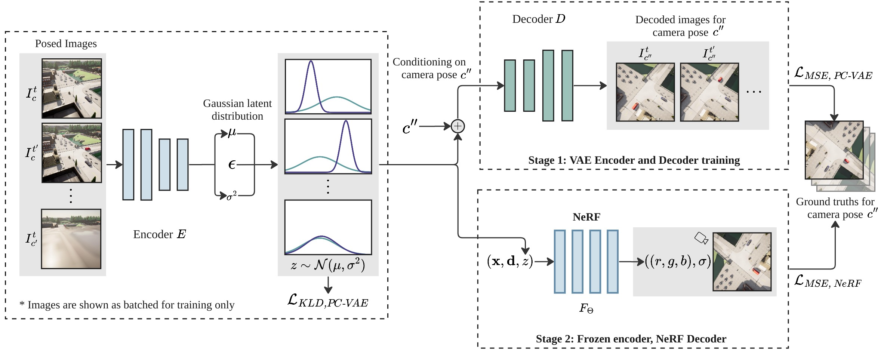
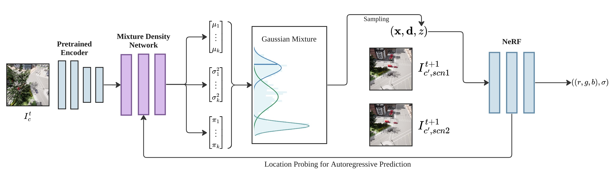
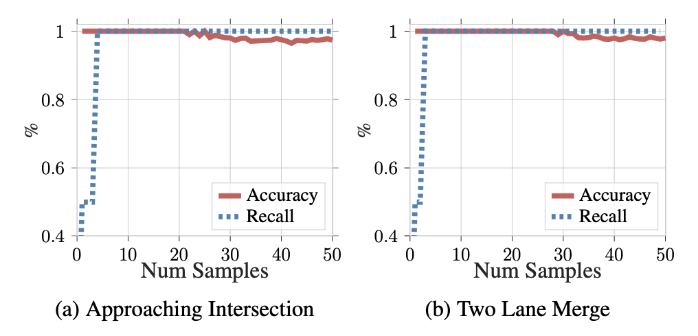
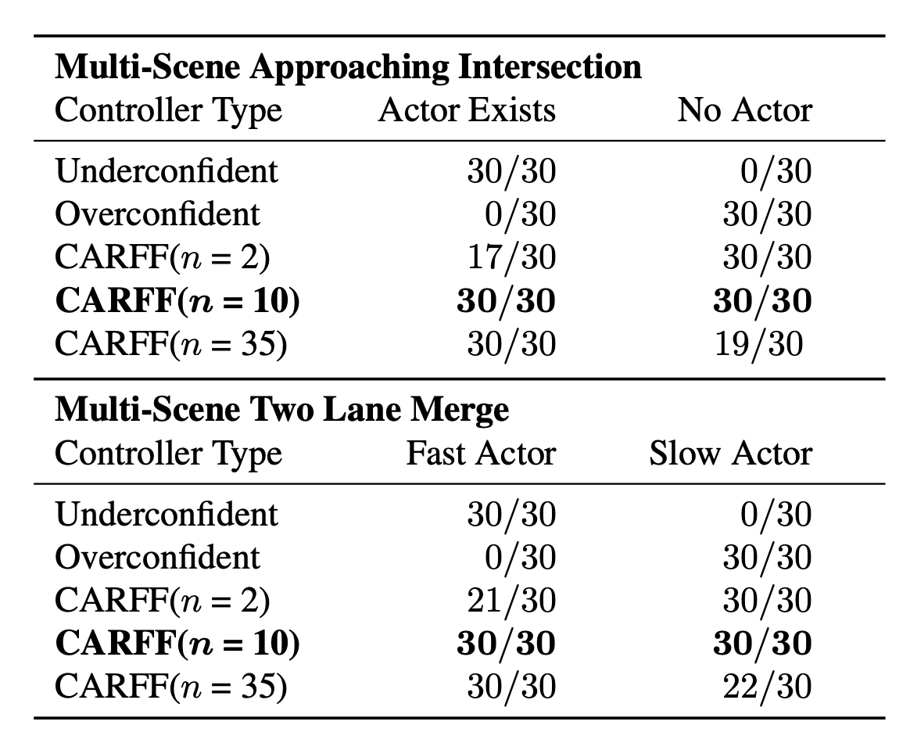

# CARFF: Conditional Auto-encoded Radiance Field for Forecasting (CVPR 2024 Submission)


[Project Page With Video](https://www.carff.website/)

This is an official implementation. The codebase is implemented using [PyTorch](https://pytorch.org/) and tested on [Ubuntu](https://ubuntu.com/) 22.04.2 LTS.

## Abstract
We propose CARFF, a method for predicting future 3D scenes given past observations, such as 2D egocentric images. Our method maps an image to a distribution over plausible latent scene configurations using a probabilistic encoder, and predicts the evolution of the hypothesized scenes through time. Our latent scene representation conditions a global Neural Radiance Field (NeRF) to represent a 3D scene model, which enables intuitive and explainable predictions. Unlike prior work in neural rendering, our approach models both uncertainty in environment state and dynamics. We employ a two-stage training of Pose-Conditional-VAE and NeRF to learn 3D representations. Additionally, we auto-regressively predict latent scene representations as a partially observable Markov decision process, utilizing a mixture density network. We demonstrate the utility of our method in realistic scenarios using the CARLA driving simulator, where CARFF can be used to enable efficient trajectory and contingency planning in complex multi-agent autonomous driving scenarios involving visual occlusions.

## Installation

### `Configure environment`

Install [Miniconda](https://docs.conda.io/en/latest/miniconda.html) (recommended) or [Anaconda](https://www.anaconda.com/).

Please follow the readme files for each folder to create and activate a virtual environment for each subpart of this repository.

## Two-Stage Training and Inference

### CARFF's two stage training process

The PC-VAE encodes images into Gaussian latent distributions. Upper right: the pose-conditional decoder stochastically decodes the sampled latent using the given camera pose into an image. The decoded reconstruction and ground truth images are used in the MSE loss for the PC-VAE. Lower right: a NeRF is trained by conditioning on latent variables sampled from the optimized Gaussian parameters. These parameters characterize the timestamp distributions derived from PC-VAE. We use a separate MSE loss for the NeRF as well.




### CARFF's auto-regressive inference pipeline

The input image is encoded using pre-trained PC-VAE to obtain a latent distribution, which is fed into our MDN model. The MDN predicts a mixture of Gaussians, which is sampled to obtain a predicted latent used to render a 3D view of the scene. To perform auto-regressive predictions, we probe the NeRF for the location of the car and feed the information back to the pre-trained encoder to predict the scene at the next timestamp.



## Results
### Accuracy and recall curves from predicted beliefs

From the number of samples starting at 0 to 50, the belief state coverage generated under partial observation (recall), and the proportion of correct beliefs sampled under full observation (accuracy) is plotted for predicted beliefs. There is an ideal margin between the two as shown in the curves above for the two Multi-Scene CARLA datasets used to train our model.



### CARFF planning with controllers

CARFF-based controllers outperform baseline controllers by choosing the optimal action in potential collision scenarios over all 30 trials conducted.



## License and Citation

```bibtex
@article{yang2023carff,
  title={{CARFF}: Conditional Auto-encoded Radiance Field for 3D Scene Forecasting},
  author={Yang, Jiezhi ``Stephen'' and Desai, Khushi and Bhatia, Harshil
  and Packer, Charles and Gonzalez, Joseph E.},
  journal={arXiv preprint arXiv},
  year={2023}
}
```